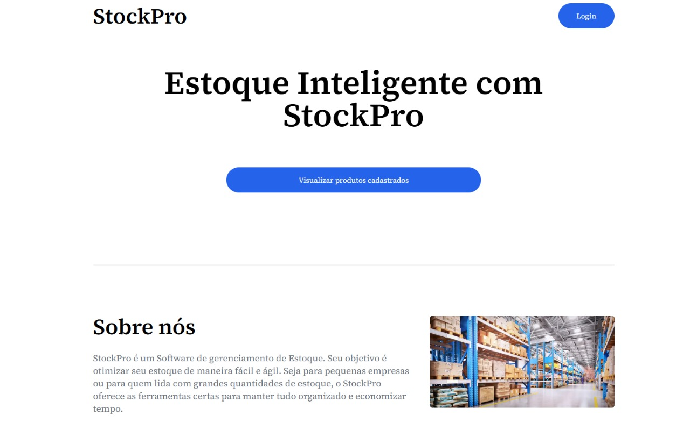
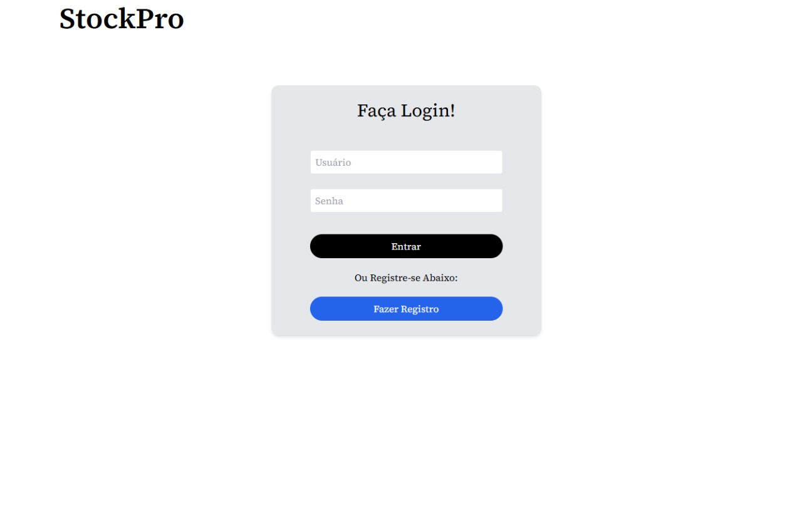
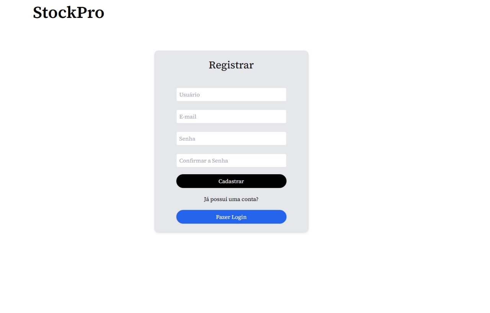
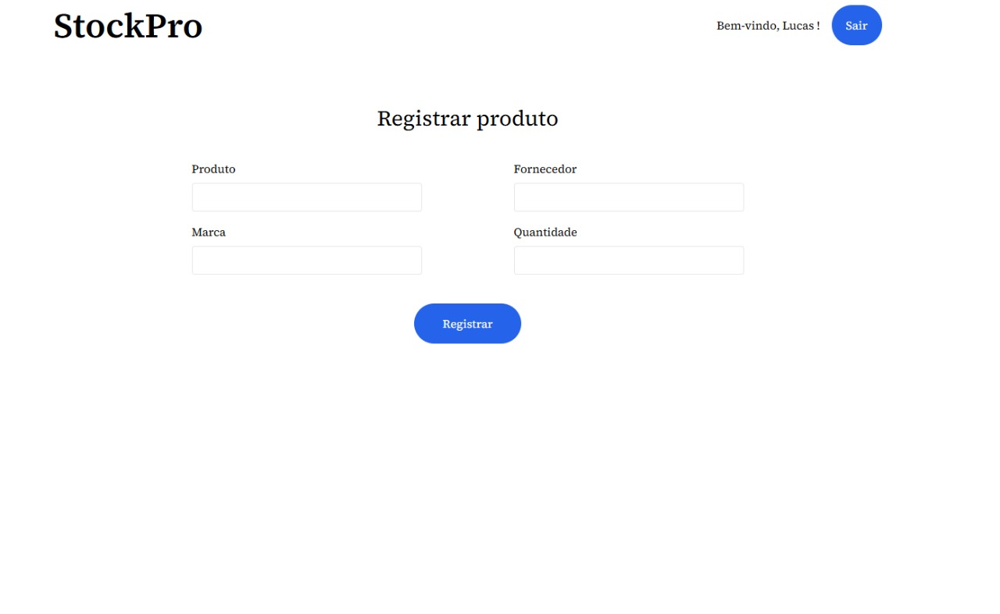
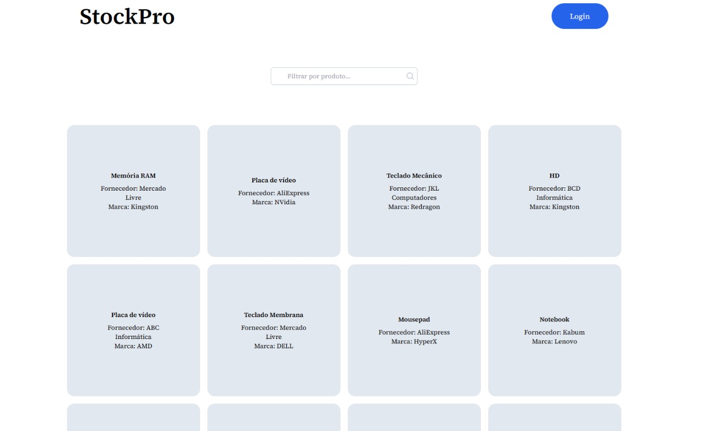

## Pré-requisitos

Nodejs; JDK 21 ou superior; IDE de preferência.

## Como rodar a aplicação

Para rodar a aplicação, siga as instruções abaixo:

1. Baixe este repositório com a aplicação em seu computador.
3. Baixe e instale o Nodejs LTS.
4. Baixe e instale a JDK 21 ou superior.
5. Defina a variável de ambiente JAVA_HOME e adicione o caminho para o executável Java ao PATH.
6. Abra o terminal ou prompt de comando e navegue até a pasta deste repositório.
7. Abra a pasta front-end do projeto em sua IDE.
8. Execute o comando **`npm run dev`** para executar o projeto na pasta front-end no terminal.
9. Abra **`(http://localhost:3000 )`** em seu navegador para ver o resultado.
10. Abra a pasta back-end do projeto em sua IDE.
11. Rode a aplicação back-end na IDE de preferência e um servidor TomCat será aberto em **`(http://localhost:8080)`**

Certifique-se de que todas as dependências estejam instaladas corretamente antes de rodar a aplicação. Em caso de dúvidas ou problemas, consulte a documentação oficial do NextJs e Java.

Página Inicial 

Página de Login

Página de Registro

Página de Registro de Produtos

Página de Visualização de Produtos

